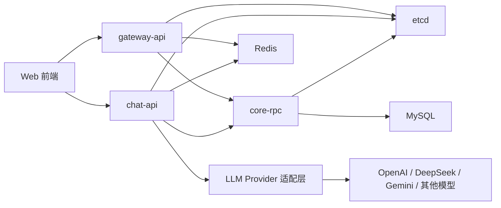
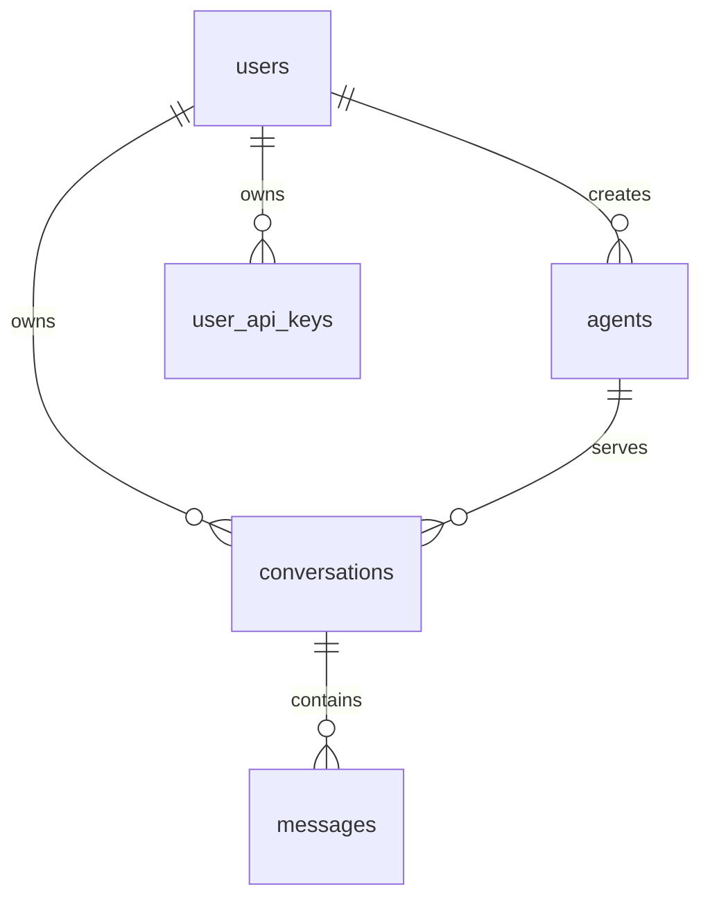

# AgentForge v1.0 系统设计文档

## 1. 这份文档是干什么的

这份文档用来先把 AgentForge 第一版要做什么、不做什么、系统怎么分层、数据怎么存、接口怎么设计说清楚。

目标不是一次把所有长期规划都做完，而是先把第一版做成一个可以真正跑起来的最小可用产品。

第一版完成后，用户应该可以：

1. 注册并登录系统
2. 创建自己的 Agent
3. 在聊天窗口里选择 Agent 发消息
4. 实时看到 Agent 按流式方式返回内容

## 2. 产品定位

AgentForge 是一个支持创建 AI Agent、接入多个模型、扩展工具调用和工作流能力的 AI Agent 平台。

对用户来说，最核心的使用方式很简单：

1. 登录
2. 创建 Agent
3. 给 Agent 配置名字、说明、系统提示词、模型
4. 在聊天窗口里和 Agent 对话
5. 实时看到返回结果

第一版先把这个核心闭环跑通。

### 2.1 当前仓库边界

当前这个仓库只负责后端服务，不负责前端页面代码。

也就是说，这个仓库里会放：

1. `gateway-api`
2. `chat-api`
3. `core-rpc`
4. 公共配置
5. 部署文件
6. SQL 迁移脚本

不会放：

1. React / Vue 页面代码
2. 前端构建配置
3. 前端组件和路由

前端建议单独放在独立仓库里，例如 `agentforge-web`。

## 3. 已确认范围和当前假设

### 3.1 已确认

以下内容是已经从当前仓库背景和你的说明里确认的：

1. 这是一个长期维护的 AI Agent 平台，不是一次性的 Demo。
2. 用户登录后，可以自己创建 Agent。
3. 用户通过聊天调用 Agent。
4. Agent 需要支持流式返回结果。
5. 平台后续会支持工具调用、工作流、多模型接入。

### 3.2 当前设计假设

以下内容还没有代码和产品文档确认，但为了让第一版能开始落地，这份设计文档先按这些假设往下走：

1. 第一版提供邮箱注册和邮箱密码登录。
2. 第一版只支持文本对话，不支持图片、语音、文件上传。
3. 第一版的 Agent 只有创建者自己可见，不做公开市场和分享广场。
4. 第一版的聊天能力先以“模型直接回答”为主，不真正执行工具调用和工作流。
5. 第一版整体采用 go-zero 微服务架构。
6. 第一版保留工具调用和工作流的扩展位置，但不把它们做成可用功能。

如果后面你决定改成手机验证码登录、OAuth 登录、公开 Agent 市场，这份文档可以再改，但不会影响第一版先开始编码。

## 4. 第一版目标和非目标

### 4.1 第一版必须完成的内容

1. 用户注册
2. 用户登录和鉴权
3. Agent 的新增、查看、修改、删除
4. 创建会话
5. 发送消息
6. 保存消息记录
7. 基于 Agent 配置调用指定模型
8. 通过 SSE 把模型返回内容一段一段推给前端

### 4.2 第一版明确不做的内容

1. 可视化 Workflow 编排
2. 真正的工具调用执行
3. RAG 和知识库检索
4. MCP 接入
5. 多租户和团队协作
6. 支付、套餐、用量计费
7. Agent 广场、模板市场、分享链接
8. 图片和文件消息

这样做的原因很直接：

如果第一版同时做登录、Agent、聊天、工作流、工具调用、知识库、插件，代码很快会失控，后面改方向的成本会很高。

## 5. 第一版用户流程

### 5.1 注册和登录

1. 用户输入邮箱、密码、昵称，提交注册。
2. 服务端检查邮箱是否已经存在。
3. 如果邮箱已存在，直接返回“邮箱已被使用”。
4. 如果邮箱不存在，服务端把密码加密后写入数据库。
5. 注册成功后，用户用邮箱和密码登录。
6. 登录成功后，服务端返回访问令牌和刷新令牌。
7. 前端后续请求把访问令牌放到请求头里。

### 5.2 创建 Agent

1. 用户进入 Agent 管理页。
2. 用户填写 Agent 名称、说明、系统提示词、模型提供商、模型名称、温度参数。
3. 服务端校验这些字段是否为空、是否超长、是否在允许范围内。
4. 校验通过后，服务端把 Agent 保存到数据库，并和当前登录用户绑定。
5. 返回 Agent 详情。

### 5.3 发起一次聊天

1. 用户进入聊天页，选择一个 Agent。
2. 用户输入一条消息并点击发送。
3. 前端调用聊天流式接口。
4. 如果前端没有传会话 ID，服务端先创建新会话。
5. 服务端先把用户这条消息保存到数据库。
6. 服务端读取这个 Agent 的系统提示词、模型提供商、模型名称。
7. 服务端读取当前会话最近一段消息，按顺序拼成模型请求内容。
8. 服务端调用对应模型的流式接口。
9. 模型每返回一小段文本，服务端马上通过 SSE 推给前端。
10. 前端一边收到内容，一边把内容显示在聊天窗口里。
11. 模型结束后，服务端把完整的回答拼起来，保存成一条 assistant 消息。
12. 服务端再发一个“本次回答结束”的 SSE 事件，前端停止 loading。

### 5.4 聊天失败时怎么处理

1. 如果 Agent 不存在，直接返回错误，不创建消息。
2. 如果会话不属于当前用户，直接返回无权限错误。
3. 如果模型调用失败，服务端发送一个错误事件给前端。
4. 如果模型在流式返回中途失败，前端会收到错误事件，当前这条 assistant 消息不标记为成功完成。
5. 用户消息已经保存，因为这条消息确实发出去了。
6. assistant 消息只有在成功拿到完整结果后才写入最终内容。

这样做的结果是：

失败时不会把一条不完整的 AI 回答当成正常消息保存下来，但用户发出去的话还会保留，方便后面重试。

## 6. 系统整体结构

### 6.1 总体思路

第一版整体采用 Go + go-zero 微服务架构。

但这里的“微服务”不是一开始就拆成很多小服务，而是先拆成少量边界清楚的服务。

第一版建议先落这 3 个服务：

1. `gateway-api`
2. `chat-api`
3. `core-rpc`

再加上基础设施：

1. MySQL
2. Redis
3. etcd

这样做的原因是：

1. 先满足“整体是微服务”的架构方向。
2. 服务数量少，第一版开发和排查还不会太痛苦。
3. 聊天流式返回这条链路可以单独放在 `chat-api`，避免一开始就把“流式输出”和“内部服务拆分”同时做得过于复杂。
4. 后面如果工具调用、工作流、异步执行越来越重，再继续拆出 `runtime-rpc` 或 `workflow-rpc` 也不会推翻现在的结构。

### 6.2 架构图



### 6.3 模块职责

#### gateway-api

负责对前端提供普通 HTTP 接口。

第一版主要负责：

1. 注册
2. 登录
3. 刷新令牌
4. Agent 管理
5. 会话列表查询
6. 消息列表查询

它本身不直接操作数据库，而是通过 `core-rpc` 完成业务数据读写。

#### chat-api

负责聊天流式接口，也就是 `/api/v1/chat/stream` 这条最特殊的长连接接口。

第一版把它单独拆出来，是因为这条链路和普通 CRUD 接口差别很大：

1. 它要保持长连接
2. 它要一段一段往前端推数据
3. 它要实时调用外部模型
4. 它的超时控制和错误处理方式和普通接口不同

它的职责是：

1. 校验当前用户身份
2. 调 `core-rpc` 读取 Agent 和会话信息
3. 调 `core-rpc` 保存用户消息
4. 按规则组装上下文
5. 调用模型流式接口
6. 把模型输出按 SSE 推给前端
7. 流式结束后，再调 `core-rpc` 保存 assistant 消息

#### core-rpc

负责所有核心数据读写和基础业务规则。

第一版主要负责：

1. 用户注册和登录时的数据处理
2. Agent 的增删改查
3. 会话创建和查询
4. 消息保存和查询
5. 聊天所需的 Agent、会话、消息数据读取

这个服务是第一版最核心的数据服务。

#### LLM Provider 适配层

负责把不同模型厂商的调用方式统一起来。

比如：

1. 上层只关心“给我发起一次聊天”
2. 下面再分别处理 OpenAI、DeepSeek、Gemini 的请求格式差异

第一版里，这一层放在 `chat-api` 内部，不单独拆成 RPC 服务。

这样做的原因很明确：

1. 聊天流式返回需要一边读模型输出、一边推给前端。
2. 如果第一版就把模型流式调用再拆到另一个 RPC 服务里，链路会明显更复杂。
3. 先把 `chat-api` 做稳定，后面再抽 `runtime-rpc`，成本更低。

## 7. 目录结构设计

```text
agentforge/
├── apps/
│   ├── gateway-api/
│   │   ├── agent.api
│   │   ├── etc/
│   │   ├── internal/
│   │   │   ├── config/
│   │   │   ├── handler/
│   │   │   ├── logic/
│   │   │   ├── middleware/
│   │   │   ├── svc/
│   │   │   └── types/
│   │   └── gateway.go
│   ├── chat-api/
│   │   ├── chat.api
│   │   ├── etc/
│   │   ├── internal/
│   │   │   ├── config/
│   │   │   ├── handler/
│   │   │   ├── logic/
│   │   │   ├── middleware/
│   │   │   ├── svc/
│   │   │   └── types/
│   │   └── chat.go
│   └── core-rpc/
│       ├── core.proto
│       ├── etc/
│       ├── internal/
│       │   ├── config/
│       │   ├── logic/
│       │   ├── server/
│       │   └── svc/
│       ├── pb/
│       └── core.go
├── configs/
│   ├── config.example.yaml
│   └── config.local.yaml
├── docs/
│   └── agentforge-v1-design.md
├── pkg/
│   ├── auth/
│   ├── config/
│   ├── constants/
│   ├── errors/
│   ├── llm/
│   │   ├── openai/
│   │   ├── deepseek/
│   │   ├── gemini/
│   │   └── provider.go
│   ├── response/
│   └── xcontext/
├── deploy/
│   ├── docker-compose/
│   └── k8s/
├── sql/
│   └── migrations/
├── scripts/
│   ├── gen-api.sh
│   └── gen-rpc.sh
├── go.mod
└── README.md
```

### 7.1 这样拆的原因

1. `apps/` 下面每个目录就是一个独立服务，符合 go-zero 的生成和维护方式。
2. `gateway-api` 和 `chat-api` 都是对前端暴露 HTTP 的服务，但职责不同。
3. `core-rpc` 只负责核心数据和基础业务，避免每个 API 服务都直接写数据库。
4. `pkg/config` 放公共配置结构，后面新增服务时直接复用，不要每个服务自己重新定义一套。
5. `pkg/` 其余目录放跨服务复用的通用能力，比如统一错误、鉴权工具、模型抽象接口。
6. `scripts/` 统一放 goctl 生成脚本，避免每次手敲命令。

## 8. 核心对象设计

### 8.1 User

用户本身。

负责表示“谁在使用平台”。

### 8.2 Agent

用户创建的智能体。

第一版里，它主要由这些信息组成：

1. 名称
2. 描述
3. 系统提示词
4. 使用哪个模型厂商
5. 使用哪个具体模型
6. 温度等生成参数

### 8.3 Conversation

一段连续对话。

它的作用是把多条消息归到一起。

比如同一个用户和同一个 Agent 可以有多段会话，每一段会话有自己的标题和消息列表。

### 8.4 Message

会话中的单条消息。

第一版消息角色只需要支持：

1. `user`
2. `assistant`
3. `system`

后面做工具调用时，再补 `tool`。

## 9. 数据库设计

### 9.1 表清单

第一版使用 5 张表：

1. `users`
2. `agents`
3. `conversations`
4. `messages`
5. `user_api_keys`

### 9.2 users

用途：保存用户基本信息和登录信息。

| 字段 | 类型 | 说明 |
| --- | --- | --- |
| id | bigint | 主键 |
| email | varchar(128) | 用户邮箱，唯一 |
| password_hash | varchar(255) | 加密后的密码 |
| nickname | varchar(64) | 用户昵称 |
| status | tinyint | 1 正常，2 禁用 |
| last_login_at | datetime | 最后登录时间 |
| created_at | datetime | 创建时间 |
| updated_at | datetime | 更新时间 |
| deleted_at | datetime null | 软删除时间 |

### 9.3 agents

用途：保存用户创建的 Agent 配置。

| 字段 | 类型 | 说明 |
| --- | --- | --- |
| id | bigint | 主键 |
| user_id | bigint | 创建者用户 ID |
| name | varchar(128) | Agent 名称 |
| description | varchar(500) | Agent 简介 |
| system_prompt | text | 系统提示词 |
| model_provider | varchar(64) | 模型提供商，例如 openai |
| model_name | varchar(128) | 模型名称，例如 gpt-4o-mini |
| temperature | decimal(3,2) | 温度，范围 0.00 到 2.00 |
| max_tokens | int null | 单次回答最大输出长度 |
| status | tinyint | 1 启用，2 停用 |
| created_at | datetime | 创建时间 |
| updated_at | datetime | 更新时间 |
| deleted_at | datetime null | 软删除时间 |

### 9.4 conversations

用途：保存会话信息。

| 字段 | 类型 | 说明 |
| --- | --- | --- |
| id | bigint | 主键 |
| user_id | bigint | 当前会话所属用户 |
| agent_id | bigint | 当前会话使用的 Agent |
| title | varchar(255) | 会话标题 |
| status | tinyint | 1 正常，2 归档 |
| last_message_at | datetime null | 最后一条消息时间 |
| created_at | datetime | 创建时间 |
| updated_at | datetime | 更新时间 |
| deleted_at | datetime null | 软删除时间 |

### 9.5 messages

用途：保存聊天消息。

| 字段 | 类型 | 说明 |
| --- | --- | --- |
| id | bigint | 主键 |
| conversation_id | bigint | 所属会话 ID |
| user_id | bigint | 发消息的用户 ID，assistant 消息可为空 |
| agent_id | bigint | 本次会话的 Agent ID |
| role | varchar(32) | user / assistant / system |
| content | longtext | 消息全文 |
| model_provider | varchar(64) null | 生成该回答的模型提供商 |
| model_name | varchar(128) null | 生成该回答的模型名称 |
| prompt_tokens | int null | 输入 token 数 |
| completion_tokens | int null | 输出 token 数 |
| status | tinyint | 1 成功，2 失败 |
| error_message | varchar(500) null | 失败原因摘要 |
| created_at | datetime | 创建时间 |
| updated_at | datetime | 更新时间 |
| deleted_at | datetime null | 软删除时间 |

### 9.6 user_api_keys

用途：保存用户自己的模型密钥。

这张表是为了后面支持“用户自己接自己的模型”准备的。

第一版即使先不用，也建议把表设计好。

| 字段 | 类型 | 说明 |
| --- | --- | --- |
| id | bigint | 主键 |
| user_id | bigint | 所属用户 |
| provider | varchar(64) | 模型提供商 |
| api_key_ciphertext | text | 加密后的密钥 |
| api_base_url | varchar(255) null | 自定义接口地址 |
| status | tinyint | 1 启用，2 停用 |
| created_at | datetime | 创建时间 |
| updated_at | datetime | 更新时间 |
| deleted_at | datetime null | 软删除时间 |

### 9.7 表关系



### 9.8 表归属

第一版的数据表统一由 `core-rpc` 负责读写。

也就是说：

1. `gateway-api` 不直接连这些业务表
2. `chat-api` 也不直接连这些业务表
3. 两个 API 服务都通过 `core-rpc` 读写用户、Agent、会话、消息数据

这样做的结果是：

1. 数据规则只放一处
2. 后面改字段或改校验时，不会出现多个服务各改一遍
3. 聊天链路虽然单独拆成 `chat-api`，但数据口径还是统一的

## 10. 接口设计

这一节分成两层来看：

1. 前端调用的 HTTP 接口
2. 服务之间调用的 RPC 接口

### 10.1 gateway-api 对外接口

#### POST /api/v1/auth/register

输入：

1. email
2. password
3. nickname

输出：

1. 用户 ID
2. 邮箱
3. 昵称

#### POST /api/v1/auth/login

输入：

1. email
2. password

输出：

1. access_token
2. refresh_token
3. expires_in
4. user_info

#### POST /api/v1/auth/refresh

输入：

1. refresh_token

输出：

1. 新的 access_token
2. 新的 refresh_token

#### GET /api/v1/agents

返回当前登录用户自己的 Agent 列表。

#### POST /api/v1/agents

创建 Agent。

关键输入：

1. name
2. description
3. system_prompt
4. model_provider
5. model_name
6. temperature
7. max_tokens

#### GET /api/v1/agents/:id

返回单个 Agent 详情。

#### PUT /api/v1/agents/:id

更新 Agent。

#### DELETE /api/v1/agents/:id

删除 Agent。

这里建议做软删除。

这样做的结果是：

用户删掉 Agent 后，历史会话和消息还可以保留，不会因为 Agent 被删导致历史数据找不到。

#### GET /api/v1/conversations

返回当前用户的会话列表。

支持按 agent_id 过滤。

#### POST /api/v1/conversations

手动创建一段新会话。

如果前端不想单独调这个接口，也可以直接调用聊天接口，让服务端自动建会话。

#### GET /api/v1/conversations/:id/messages

返回某段会话下的消息列表，按时间正序返回。

### 10.2 chat-api 对外接口

#### POST /api/v1/chat/stream

输入：

1. agent_id
2. conversation_id，可为空
3. message

处理步骤：

1. `chat-api` 校验当前用户身份。
2. `chat-api` 调 `core-rpc` 检查当前用户是否拥有这个 Agent。
3. 如果 `conversation_id` 为空，`chat-api` 调 `core-rpc` 创建一条新会话。
4. `chat-api` 调 `core-rpc` 保存用户消息。
5. `chat-api` 调 `core-rpc` 读取最近的历史消息。
6. `chat-api` 在本地组装模型请求。
7. `chat-api` 选择对应模型适配器并发起流式调用。
8. 每收到一段模型输出，`chat-api` 立即发 SSE 事件给前端。
9. 流式结束后，`chat-api` 调 `core-rpc` 保存完整 assistant 消息。
10. `chat-api` 返回结束事件。

建议的 SSE 事件格式：

1. `conversation.created`
   作用：告诉前端本次会话 ID 是多少
2. `message.delta`
   作用：告诉前端“新增了一小段文本”
3. `message.completed`
   作用：告诉前端“整条回答已经结束”
4. `error`
   作用：告诉前端本次调用失败

示例：

```text
event: conversation.created
data: {"conversation_id":123}

event: message.delta
data: {"delta":"你好，"}

event: message.delta
data: {"delta":"我是你的 Agent。"}

event: message.completed
data: {"message_id":456}
```

### 10.3 core-rpc 内部接口

`core-rpc` 不直接给前端调用，只给 `gateway-api` 和 `chat-api` 用。

第一版建议至少包含下面这些 RPC 能力：

1. `RegisterUser`
2. `VerifyLogin`
3. `CreateAgent`
4. `UpdateAgent`
5. `DeleteAgent`
6. `GetAgent`
7. `ListAgents`
8. `CreateConversation`
9. `ListConversations`
10. `GetConversationMessages`
11. `CreateUserMessage`
12. `CreateAssistantMessage`
13. `BuildChatContext`

其中 `BuildChatContext` 的作用不是直接调用模型，而是把聊天所需的这些数据一次取全：

1. Agent 配置
2. 会话信息
3. 最近消息列表

这样 `chat-api` 拿到数据后，就能直接开始调模型，不需要自己再拆很多次 RPC。

## 11. 聊天上下文组装规则

为了避免消息越来越多、请求越来越大，第一版先用一个简单且可控的规则：

1. 永远带上 Agent 的系统提示词
2. 再取当前会话最近 20 条消息
3. 按时间顺序拼接后发给模型

这样做的结果是：

1. 模型知道这个 Agent 的角色设定
2. 能记住最近这轮对话
3. 不会因为上下文无限增长导致响应变慢或费用失控

后面如果要做更精细的 token 裁剪，再单独升级这一块。

## 12. 鉴权设计

第一版建议使用：

1. 短期访问令牌
2. 长期刷新令牌

具体方式：

1. 登录成功后，服务端返回一个有效期较短的访问令牌。
2. 前端请求接口时带上访问令牌。
3. 访问令牌过期后，前端拿刷新令牌换新令牌。
4. `gateway-api` 负责签发和校验访问令牌。
5. 刷新令牌保存在 Redis 中，支持主动失效。

这样做的原因：

1. 访问令牌泄漏后，风险时间较短。
2. 用户退出登录时，可以让刷新令牌立即失效。

## 13. LLM 接入设计

### 13.1 统一接口

第一版必须一开始就把模型接入抽象好。

建议定义统一接口：

```go
type Provider interface {
    Chat(ctx context.Context, req *ChatRequest) (*ChatResponse, error)
    Stream(ctx context.Context, req *ChatRequest, handler StreamHandler) error
}
```

这段代码的作用是：

1. 上层聊天流程只调用统一接口
2. 不关心下面到底是 OpenAI、DeepSeek 还是 Gemini
3. 新增模型时，只新增实现，不改聊天主流程

执行流程是：

1. 聊天模块根据 `model_provider` 找到对应实现
2. 构造统一的 `ChatRequest`
3. 调用 `Stream`
4. 每来一段内容，就交给 `handler`
5. `handler` 再把内容写到 SSE

最终结果是：

聊天主流程保持稳定，模型扩展成本低。

在 go-zero 微服务方案下，这层能力先放在 `chat-api` 内部，而不是先拆成独立 RPC 服务。

这是第一版刻意做的取舍：

1. `chat-api` 自己拉模型流式输出，能最直接地往前端写 SSE。
2. `core-rpc` 只负责数据，不参与模型流式传输。
3. 等第二版真的需要把“模型调用”和“聊天接入层”拆开时，再新增 `runtime-rpc`。

## 14. 配置设计

配置建议拆成几类：

1. 服务配置
2. 数据库配置
3. Redis 配置
4. etcd 配置
5. JWT 配置
6. 模型平台配置

建议保存在 `configs/config.local.yaml`。

### 14.1 配置分层规则

后面的配置不建议每个服务都各写一套重复结构，而是分成两层：

#### 公共层

公共层放所有多个服务都可能复用的配置结构。

例如：

1. JWT
2. MySQL
3. Redis
4. 模型平台配置

这些结构统一放在 `pkg/config`。

#### 服务层

服务层只放当前服务自己独有的配置。

例如：

1. `gateway-api` 的 HTTP 监听地址
2. `chat-api` 的 HTTP 监听地址
3. `core-rpc` 的 RPC 监听地址
4. `core-rpc` 在 etcd 里注册的服务名

这样做的结果是：

1. 新增服务时，公共配置不用重新定义
2. 改公共字段时，只改一处
3. 不会出现 `JWTConf`、`RedisConf` 在多个服务里复制粘贴很多份

### 14.2 当前实现约定

第一版按下面的方式落地：

1. `pkg/config` 定义公共配置结构
2. 每个服务自己的 `internal/config` 负责把公共配置和本服务独有配置组合起来
3. 每个服务仍然保留自己的启动配置文件，因为监听端口、服务名、注册信息本来就不一样

这意味着：

1. 配置结构是公共复用的
2. 服务启动文件仍然是各自独立的

这样比较适合 go-zero 的服务启动方式，也方便后面继续扩展更多服务

### 14.3 本机开发环境建议

第一版本地开发可以优先使用本机安装的 MySQL 和 Redis，不强制要求一直开 Docker。

这样做的原因是：

1. 本机直接启动更省资源
2. 对开发机配置一般的情况更友好
3. 当前项目还在早期阶段，本地开发优先保证启动简单和调试顺畅

推荐方式：

1. 本机启动 MySQL
2. 本机启动 Redis
3. 创建数据库 `agentforge`
4. 执行 `sql/migrations/001_init.sql` 建表

数据库创建时建议：

1. 字符集使用 `utf8mb4`
2. 排序规则优先使用 `utf8mb4_0900_ai_ci`
3. 如果本机没有 `utf8mb4_0900_ai_ci`，使用 `utf8mb4_unicode_520_ci` 也可以

这意味着：

1. 你截图里选的 `utf8mb4_unicode_520_ci` 是可用的
2. 这个选择不会影响第一版正常开发
3. 只是从 MySQL 8/9 的默认习惯来看，`utf8mb4_0900_ai_ci` 会更常见一些

另外要注意：

1. 如果使用本机 MySQL，项目配置里的用户名和密码要改成你本机实际可用的那组
2. 不要默认照搬 Docker 示例里的 `root/password`

本机启动时还建议这样处理：

1. `core-rpc` 本地直接监听固定端口，比如 `127.0.0.1:8080`
2. `gateway-api` 本地直接连接这个端口
3. `chat-api` 本地也直接连接这个端口
4. 本地调试阶段先不强制依赖 `etcd`

这样做的结果是：

1. 启动步骤更少
2. 排查问题时更容易看清到底是哪一层没通
3. 注册、登录这类基础链路可以先尽快跑通

另外建议在配置命名上避开框架内部字段名。

例如：

1. 业务自己使用的 Redis，可以命名成 `AppRedis`
2. 不要直接命名成 `Redis`

这样可以避免和 go-zero 的 RPC 内部配置字段重名，导致启动时把两套配置混在一起

示例结构：

```yaml
server:
  port: 8080

mysql:
  dsn: root@tcp(127.0.0.1:3306)/agentforge?charset=utf8mb4&parseTime=True&loc=Local

redis:
  addr: 127.0.0.1:6379
  password: ""
  db: 0

etcd:
  hosts:
    - 127.0.0.1:2379
  key: agentforge.core.rpc

jwt:
  access_secret: your-access-secret
  refresh_secret: your-refresh-secret
  access_expire_minutes: 120
  refresh_expire_hours: 720

llm:
  openai:
    api_key: sk-xxx
    base_url: https://api.openai.com
```

## 15. 错误处理规则

第一版先统一错误返回格式。

普通接口建议返回：

```json
{
  "code": 40001,
  "message": "agent not found",
  "data": null
}
```

流式接口建议：

1. 在流开始前校验失败，直接返回普通 HTTP 错误响应。
2. 在流过程中失败，发送 SSE `error` 事件。

这样前端更容易区分：

1. 请求根本没成功发起来
2. 请求已经发起来了，但模型在中途失败

## 16. 日志设计

第一版日志至少要能回答下面几个问题：

1. 谁调用了哪个接口
2. 请求是否成功
3. 调用了哪个 Agent
4. 调用了哪个模型
5. 花了多长时间
6. 为什么失败

建议每次聊天记录这些字段：

1. request_id
2. user_id
3. agent_id
4. conversation_id
5. model_provider
6. model_name
7. duration_ms
8. error

这样后面排查“为什么这个用户发消息失败了”时，不需要翻很多无关日志。

## 17. 第一版开发顺序

建议按下面顺序推进：

1. 用 `goctl` 初始化 `gateway-api`
2. 用 `goctl` 初始化 `chat-api`
3. 用 `goctl` 初始化 `core-rpc`
4. 接入 MySQL、Redis、etcd、日志
5. 完成用户注册和登录
6. 完成 Agent CRUD
7. 完成会话和消息查询
8. 完成 LLM Provider 抽象
9. 完成聊天 SSE 链路
10. 补基础测试和接口文档

这个顺序的好处是：

每一步都能形成一个完整结果，不会出现“模型接好了，但用户系统还没法用”这种割裂状态。

## 18. 分支和 Commit 规范

### 18.1 分支规范

建议使用：

1. `main` 作为稳定分支
2. `feature/...` 开发新功能
3. `fix/...` 修问题

示例：

1. `feature/init-project`
2. `feature/auth-module`
3. `feature/agent-crud`
4. `feature/chat-stream`

### 18.2 Commit 规范

建议使用：

1. `feat: ...`
2. `fix: ...`
3. `refactor: ...`
4. `docs: ...`
5. `chore: ...`

示例：

1. `feat: 初始化项目结构和基础配置`
2. `feat: 完成用户注册登录接口`
3. `feat: 新增 Agent 增删改查能力`
4. `feat: 支持聊天 SSE 流式输出`
5. `refactor: 抽象统一的 LLM Provider 接口`

## 19. 第一版验收标准

第一版完成时，至少要满足下面这些结果：

1. 新用户可以完成注册和登录
2. 登录用户可以创建多个 Agent
3. 用户可以查看和修改自己的 Agent
4. 用户可以选择 Agent 发起一段新对话
5. 用户发送消息后，可以持续收到流式返回内容
6. 刷新页面后，历史会话和历史消息还能看到
7. 至少接通一个真实模型提供商

## 20. 第二版扩展方向

第一版做完后，优先考虑下面这些扩展：

1. 工具调用
2. Workflow 编排
3. 用户自定义模型密钥管理
4. 知识库和检索
5. 多模型路由和回退策略
6. Agent 分享和模板市场

## 21. 当前结论

第一版最重要的不是把所有“AI 平台能力”一次做全，而是先做出一个稳定的最小闭环。

这个闭环就是：

1. 用户登录
2. 用户创建 Agent
3. 用户发消息
4. 服务端调用模型
5. 前端实时收到流式结果
6. 历史数据被保存下来

只要这个闭环稳定，后面的工具调用、工作流、知识库、多模型扩展都可以在这个基础上继续加。
